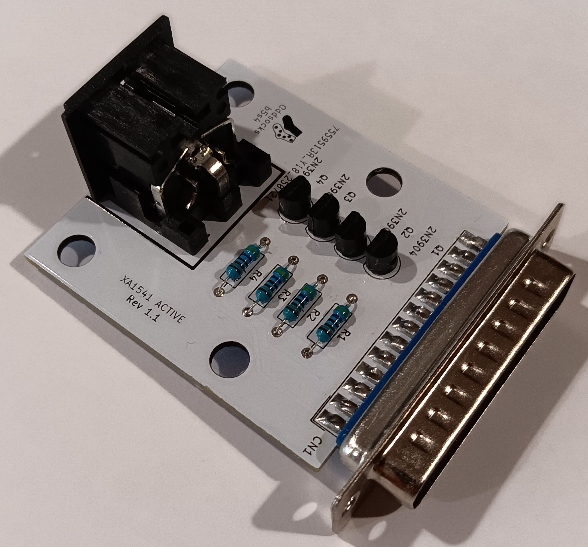
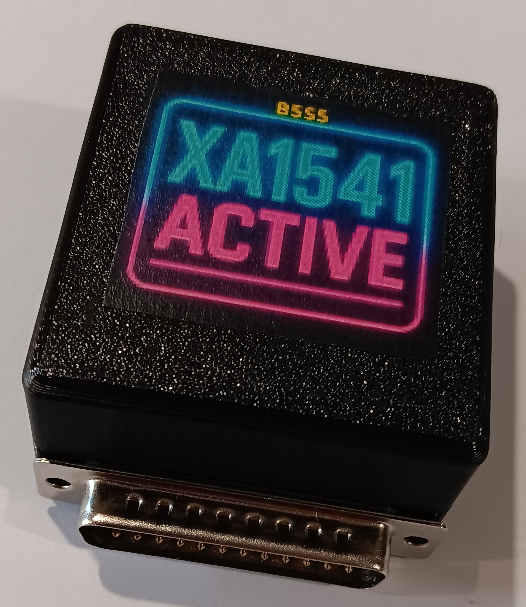
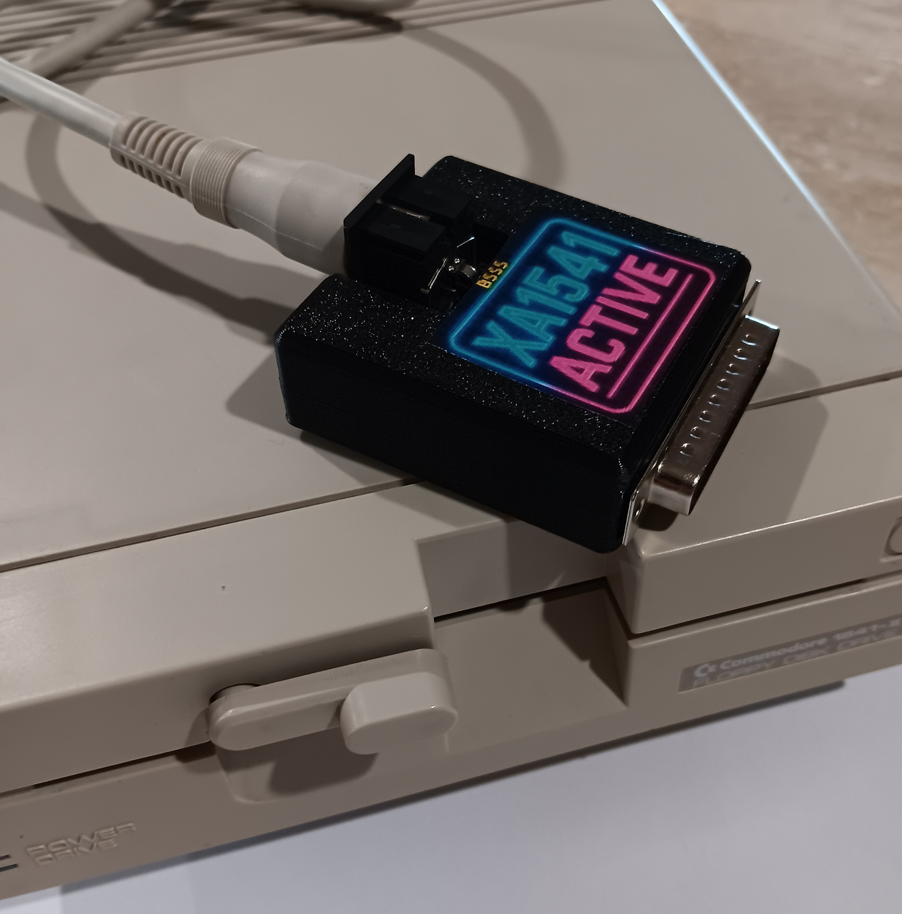

# b5s4-XA1541-Active
Read &amp; Write C64, C128 and VIC-20 disks directly on a PC using a Commodore drive

## Description

This is the b5s4 PCB version of the XA1541 Active adapter. It lets you connect Commodore Floppy Disk drives to a PC with a Parallel
Port and read and write to those disks natively. See: https://sta.c64.org/xa1541.html for additional information.

**Compatible Floppy Drives**

* Commodore 1541
* Commodore 1541-II
* Commodore 1570
* Commodore 1571
* Commodore 1581
* ... and compatibles

**Compatible Software**

* The Star Commander
* OpenCBM
* NibTools
* CMBXfer
* Mtap & Ptap
* NIBTools
* cbm4linux

## Bill of Materials

| Qty | Component                                          |
|:---:|----------------------------------------------------|
| 1   | Female DIN45322 connector                          |
| 1   | Male DB25 connector - straight - for edge mounting |
| 4   | 2N3904 transistors                                 |
| 4   | 4.7KΩ Axial Resistors - 1/4 watt                   |

## 3D Printable Case
A 3D printable case specifically designed for this PCB is also available. STLs are included in this repo and there is also a [Thingiverse Page](https://www.thingiverse.com/thing:7099785)

* Designed to use screws as they produce a much nicer, more robust case
* 4 x 3.5mm self-tapping screws to attach the shells. Max length about 12mm

## Support Me
* [My Projects](https://projects.amiga-hardware.com) - Donate on this page
* [Order the PCB](https://www.pcbway.com/project/shareproject/b5s5_XA1541_Active_Read_Write_C64_C128_VIC20_disks_on_PC_ddd3c031.html)
* [Order the Case](https://www.pcbway.com/project/shareproject/b5s4_XA1541_Active_Case_Slimline_af867c8e.html)
